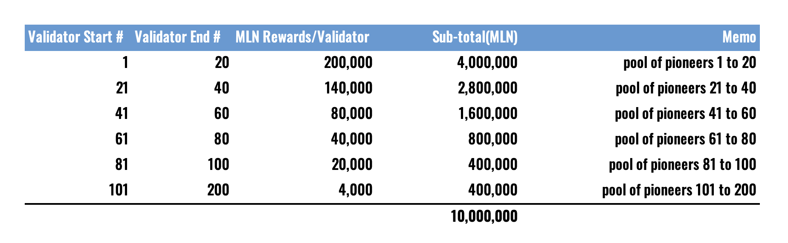

# 奇迹系列数字资产白皮书

旧的时代正在远去，文明已进入了web3.0和AI时代。AI极大提升了生产力，web3.0则天然为这种革命性的生产力提供了伴生的生产关系，亦即web3.0的立论之基：加密学支撑的去中心化。从web3到AI，产品迭代正在加速，Ai与Crypto结合的新经济模式，星火燎原，席卷全球，堪称奇迹。加密数字资产正在每个行业与角落开辟全新的价值空间。为了顺应这种不可逆转的趋势，同时为了能够引领数字资产应用，我们启动了本奇迹系列。

就像汽车是工程的奇迹，我们推出的第一个加密数字资产应用```加密卡符(Crypto-Carfoo)```或简称```卡符(Carfoo)``` 就是加密车虚拟数字资产，借此表达我们在全球变暖大背景下对碳足迹的高度关注。汽车，目前作为智能物种的第一存在形态，是高度集成并集中体现前沿科技的宿主；而卡符就是伴随智能汽车的最重要的数字资产，更是接下来发展并践行主权个人理念的理想载体。

## 主权个人时代正在到来

风起于青萍之末，终于在某一天，波涛夜惊风雨骤至，主权个人的理念势如破竹无可阻挡。值得指出的是，未来的智能车自身甚至可以成为“主权个人”，即便在当下，智能汽车行驶所产生的数据所有权也应归法律意义上的车主所有，而不是车辆生产制造商。

值得指出的是，未来的智能车自身甚至可以成为“主权个人”，即便在当下，智能驾驶所产生的数据其实也应归法律意义上的车主所有，而不是车辆生产制造商。

## 奇迹数字资产项目

奇迹数字资产项目包含2个核心部分：用户自治价值社区--米兰社区（Mirascape Horizon）和密码学驱动的去中心化基础设施社区链（米兰链, Miraland Blockchain）。前者重在用户交互体验与用户自治，后者重在提供公平公正（Fair and Equal）的信任与价值交换。

## 米兰社区(Mirascape Horizon)

奇迹数字资产项目包含2个核心部分：用户自治价值社区--米兰社区（Mirascape Horizon）和Crypto驱动的去中心化基础设施社区链（米兰链, Miraland Blockchain）。前者重在用户交互体验与用户自治，后者重在提供公平公正（Fair and Equal）的信任与价值交换。

## 米兰社区(Mirascape Horizon)

作为主权个人，任何个人、企业或AI智能均可选择加入米兰社区成为会员(Mirascapian)。米兰社区强调用户自治、用户共识及用户价值，由一个个行业主题或兴趣爱好导向的部落(tribe)组成。企业会员包括但不限于如下类型或形式的生态伙伴： 汽车品牌或制造商、经销商、快闪店、维修站、汽车保险、汽车金融、汽车租赁、汽车装饰美容、二手车机构、旅游酒店、食品饮料品牌等等。

**社区愿景：构建主权个人时代最无需信任的价值社区**

米兰社区计划推出四类数字资产，用于空投、奖励、颁发或授予社区会员：

1. 社区原生数字权证(MLN)，可用于共建社区的治理投票，承载社区共识或价值，也可用于共创众筹相关的“投票权”或“虚拟股权”探索等。 

2. 社区衍生数字权证，代表用户日常赚取、累积并用于兑换产品或服务的信用或价值，当然也可以用来映射社区的“影响力”, "投票权”甚至是“虚拟股权”；

3. 社区数字藏品(NFT)，一种可以证明用户身份，证明用户可以参与某项活动的特权与凭证，同时也是用户收藏或贮藏价值的载体之一。

4. 社区SFT，是NFT化的FT，也是FT化的NFT，兼具二者优点，既可拆分又有唯一性。

社区数字资产包括但不限于：积分、徽章、游戏道具、社区奖励、用户虚拟形象、虚拟车、其他数字权益（如兑换券）乃至值得尝试与探索的虚拟股权（取决于所在国家法律法规许可程度）等。
加密卡符应用尝试推出的虚拟车NFT是可演进的[1]，虚拟车的成长/生长取决于用户行为、会员自愿或主动贡献的行为数据或车辆数据。


社区鼓励用户创新与共创，并通过社区共识以数字资产的形式对用户进行奖励，用户对属于自己的虚拟数字资产自由处置。

社区会员可以根据需要发行自己的信用积分（Credit Tokens）或私人藏品（NFT）赠予或有偿提供给朋友或粉丝，并赋予其意义与价值，例如对发行者个体知识产权的授权访问，私人现实或虚拟空间的访问特权，对某些事件的见证与纪念等。用户发行的信用积分总量的价值（如果有的话）代表了其信用值，意味着该用户在社区的被广泛认可的信用度。

## 米兰链(Miraland Blockchain)

米兰链运行在众多节点之上，所有节点一起承担了社区共识。根据设置的目的不同，米兰链由3种网络：开发网、测试网和主网。开发网用于社区链自身的迭代和生态应用开发；测试网为不断迭代的米兰链及其上的应用服务投入主网运行之前提供充分的测试与验证；主网是是承载整个社区信任、共识、价值以及用户数字资产流转移动的真正网络载体。

米兰链基于PoS协议，是弹性可伸缩、稳定、快速、安全的分布式去中心化Lay 1区块链，最大程度规避了其他同类区块链生态中的中心化环节。米兰链脱胎于面向泛行业公众的Solana开源代码基线，执行深度改造后以适合汽车人社区的定位和需求，与此同时，秉承其开源精神，遵循原许可条款，修改并删除了软件上游的品牌商标产权及其原有的加密资产，并在其上扩展创建了必要的资源插件以满足众多部落和行业应用的需求。

米兰（MLN）是米兰链的原生通证。

验证节点是米兰链的重要基础元素，他们协同运作共同形成骨干网络。米兰链的验证者们通过处理网络交易见证并实现共识机制，使得米兰链作为web3时代社区基础设施的防篡改、高性能、无须信任的特征真实不虚。

米兰链鼓励用户加入验证节点计划，共创、共建、共治，共筑社区运转的磐石之基。

米兰链捍卫保护用户个体信用价值社区的可持续发展！

## 未来展望

社区数字资产当前为碳基文明设计，属于用户个人，但终极目标还包括硅基文明。数字资产终将为所有智能物种而设计打造（无论是碳基还是硅基物种），是智能物种之间交换信任和价值的天然的原生凭证。初期一定是在法律框架监管下在社区个人之间试点流通，中期将在主权个人和智能物种之间流转，长期看是智能物种之间相互交换的信物。


## 发行计划
**在主网上线之前存在依据社区共识及其他重要因素调整的可能性**

米兰链计划发行10亿枚原生数字通证“米兰”（MLN），其中45%将用于米兰社区空投🪂🪂🪂。米兰年增发量维持在1%的比率不变。创世米兰初始分布如下图。


米兰社区与米兰链的发展路线可以分为三大阶段：**alpha阶段**，**beta阶段**，**主网上线阶段**。根据项目进展情况，在不同阶段采取不同的数字资产发行方式。

**Alpha阶段**，团队以募集资本和招募验证节点为主要任务，越早投入项目的赞助人，获得的优惠越多；越早成为验证节点，获得的米兰奖励也越多，欢迎报名成为米兰验证节点。



在本阶段，为了凝聚社区共识，同时作为生态圈共生互联的尝试探索，社区选择采纳使用衍生数字资产$carbon作为社区的理念共识，$carbon是BTC生态里的ARC20数字资产，其发行目的是为了跟进碳足迹促进碳中和，和米兰社区加密车的理念一致，选择ARC20数字资产同时也是为了向BTC致敬。$carbon用作映射并免费获取未来社区原生加密数字资产的凭证，提供更广阔的生态创新空间。$carbon总供应量10万张，每张含20000聪BTC币本位，公平发射，自由挖取或交易获得。

**Beta阶段**，一旦完成alpha阶段的既定目标，将进入beta测试阶段，届时同时启动测试网络和开发网络，为主网上线做充分准备。

**主网上线阶段**，米兰链正式启动，原生数字权证米兰（MLN）立即生效。符合条件的前期社区用户和节点用户可以免费兑换米兰。兑换按照当前计划主要分为三类：

1） 持有$carbon免费领取

2)  参与社区活动积分兑换

3） 验证节点兑换奖励

前期持有$carbon的社区用户在主网上线后可以按照1:10的比例免费兑换米兰，同时用户继续保留自己的$carbon不变。即拥有一张$carbon可免费领取10枚米兰。
验证节点则根据加入招募计划的梯队分布领取对应的米兰奖励。
社区积分活动后续公布。

取决于社区发展情况，社区不排除在主网上线之前发行新的衍生数字资产的可能性。

## 社区贡献

我们正在寻找奇迹项目的爱好者和工程师加入项目或社区，欢迎入群或提交问题：

- [Discord](https://discord.gg/jJUGKcKNz5)
- [Whitepaper GitHub Issues](https://github.com/miraland-labs/miracle-series-whitepaper/issues)
- [Miraland Blockchain Github](https://github.com/miraland-labs/miraland)

## 附录: 开发网用户交互体验部分功能预览


注：
[1] 参见[虚拟加密车白皮书](https://github.com/miraland-labs/crypto-car-whitepaper/blob/main/WHITEPAPER.md)